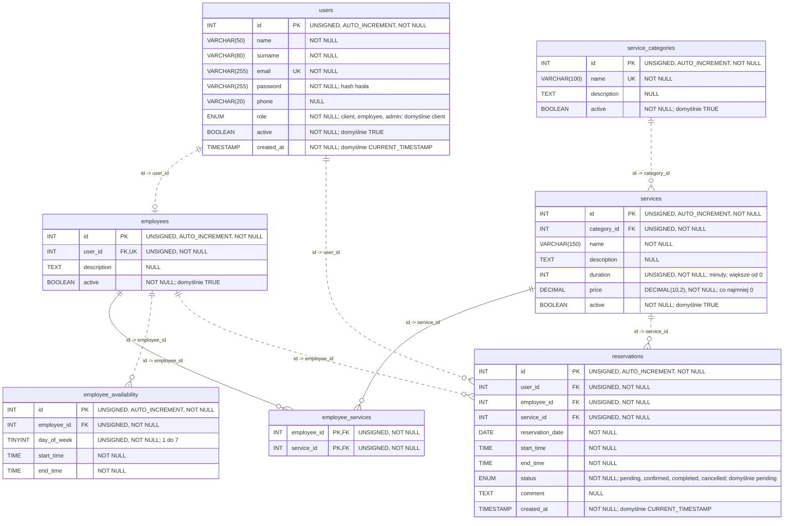

# CutTime — diagram ERD (Etap 1)

Źródło prawdy: [database/database.sql](../database/database.sql). Diagram przedstawia wszystkie 7 tabel, wszystkie kolumny i 8 relacji wynikających z kluczy obcych.

## Jak czytać diagram

- `PK` — klucz główny; `FK` — klucz obcy; `UK` — ograniczenie `UNIQUE`.
- `||` — dokładnie jeden rekord; `o|` — zero lub jeden; `o{` — zero lub wiele.
- Linia ciągła oznacza relację identyfikującą: FK należy do PK tabeli podrzędnej. Linia przerywana oznacza relację nieidentyfikującą: tabela podrzędna ma własny PK niezależny od FK.
- Typy `UNSIGNED` i szczegóły `ENUM` podano w komentarzach pól. Dla `price` pełny typ `DECIMAL(10,2)` znajduje się w komentarzu.

## Relacje i klucze obce

Każdy rekord podrzędny wskazuje dokładnie jeden rekord nadrzędny (`NOT NULL` na wszystkich FK). Rekord nadrzędny może nie mieć rekordów podrzędnych.

| Tabela nadrzędna → podrzędna | FK w tabeli podrzędnej | Liczność | ON DELETE |
|---|---|---|---|
| `users` → `employees` | `user_id` → `users.id` | 1 : 0..1 | RESTRICT |
| `service_categories` → `services` | `category_id` → `service_categories.id` | 1 : 0..N | RESTRICT |
| `employees` → `employee_services` | `employee_id` → `employees.id` | 1 : 0..N | CASCADE |
| `services` → `employee_services` | `service_id` → `services.id` | 1 : 0..N | CASCADE |
| `employees` → `employee_availability` | `employee_id` → `employees.id` | 1 : 0..N | CASCADE |
| `users` → `reservations` | `user_id` → `users.id` | 1 : 0..N | RESTRICT |
| `employees` → `reservations` | `employee_id` → `employees.id` | 1 : 0..N | RESTRICT |
| `services` → `reservations` | `service_id` → `services.id` | 1 : 0..N | RESTRICT |

Wszystkie FK mają `ON UPDATE CASCADE`. Relacja `users` → `employees` jest opcjonalna 1:1, a nie 1:N, ponieważ `employees.user_id` ma `UNIQUE`.

Relacja **N:M pomiędzy `employees` i `services`** jest realizowana przez `employee_services`. Jej złożony PK `(employee_id, service_id)` uniemożliwia ponowne zapisanie tej samej pary. Obie składowe są jednocześnie FK. Diagram pokazuje tę relację jako dwa połączenia 1:N przez tabelę pośrednią, bez dodatkowego, nieistniejącego FK.

## Ograniczenia i zakres schematu

W SQL znajdują się `CHECK`: `duration > 0`, `price >= 0`, `day_of_week BETWEEN 1 AND 7` oraz `00:00:00 <= start_time < end_time < 24:00:00` dla dostępności i rezerwacji. Według komentarza SQL dni tygodnia są numerowane od poniedziałku (1) do niedzieli (7).

Klient jest użytkownikiem o roli `client`; administrator również jest rekordem `users`. Nie ma osobnych tabel klientów i administratorów. FK `reservations.user_id` wymusza istnienie użytkownika, lecz nie jego rolę. Analogicznie FK `employees.user_id` nie sprawdza roli `employee`.

SQL nie wymusza braku nakładających się przedziałów dostępności lub rezerwacji, zgodności wizyty z dostępnością, aktywności rekordów ani tego, czy wybrany pracownik ma przypisaną daną usługę. Indeksy wspierają wyszukiwanie, ale nie zastępują tych reguł. Nie ma FK z `reservations` do `employee_services` ani do `employee_availability`, dlatego diagram nie pokazuje takich połączeń. Zachowanie historycznych rezerwacji po usunięciu przypisania usługi jest opisane w SQL jako zamierzone.

`reservations.end_time` przechowuje ustalony koniec wizyty, niezależny od późniejszych zmian `services.duration`. Dokument opisuje wyłącznie schemat Etapu 1; nie dodaje procesu rezerwacji ani innych funkcji aplikacji.
